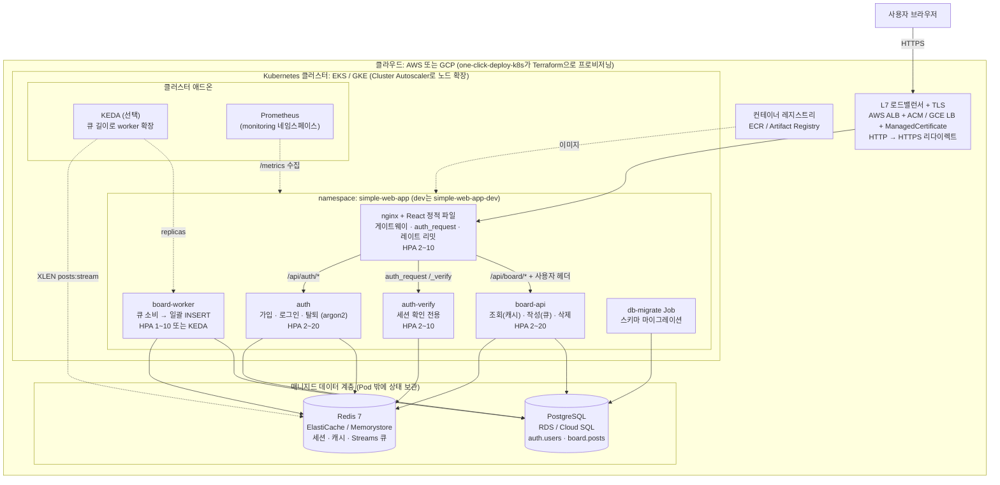
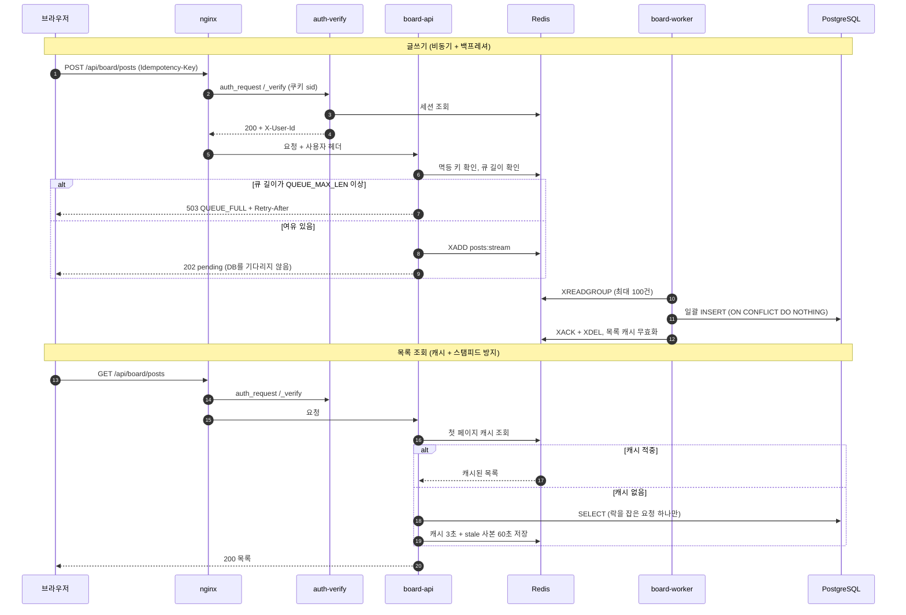
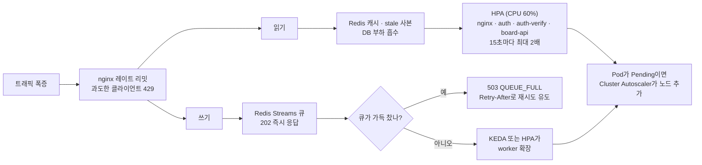
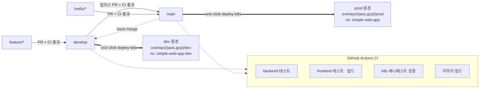

# simple-web-app

[](https://github.com/gary5876/simple-web-app/actions/workflows/ci.yml)

**이 저장소는 인프라(k8s, 오토스케일링, 멀티클라우드 배포) 공부용으로 만든 간단한 커뮤니티 게시판 서비스입니다.**
실제 운영용 제품이 아니라, 인프라를 실습하고 시연하기 위한 데모 워크로드입니다.

## 프로젝트 소개
- **무엇을 하나:** 누구나 글을 읽고, 로그인한 사용자가 글을 쓰고 지울 수 있는 게시판 하나. 기능은 회원가입·로그인·로그아웃·탈퇴, 글 목록(커서 페이지네이션)·상세·작성·본인 글 삭제뿐입니다.
- **왜 만들었나:** 재난 상황처럼 **읽기와 쓰기가 짧은 시간에 동시에 폭증하고, 그 폭증이 반복되는** 트래픽을 가정하고 그 부하를 인프라가 어떻게 받아내는지 공부하기 위해서입니다. 그래서 기능은 최소로 두고 오토스케일링, 백프레셔, 캐시, 장애 격리 같은 구조에 집중했습니다.
- **one-click-deploy-k8s와의 관계:** 클러스터·매니지드 DB/Redis·LB·DNS·인증서 같은 인프라 프로비저닝과 클라우드 배포는 별도 인프라 프로젝트 `one-click-deploy-k8s`(Terraform, AWS CLI, GCP CLI)가 맡습니다. 이 저장소는 그 프로젝트가 배포하는 **대상 워크로드**이며, 앱 코드·컨테이너 이미지·Kustomize 매니페스트와 인프라 쪽 계약([docs/deploy.md](docs/deploy.md))을 제공합니다.

## 아키텍처

### 전체 인프라 구성도
클라우드 리소스(LB, 매니지드 DB/Redis, 레지스트리, 클러스터)는 인프라 프로젝트 `one-click-deploy-k8s`가 Terraform으로 만들고, 이 저장소는 클러스터 안에서 도는 워크로드(아래 네임스페이스 부분)를 제공합니다.



- **nginx 한 곳이 입구입니다.** 정적 파일 서빙, 라우팅, 세션 확인(`auth_request`), 레이트 리밋을 모두 여기서 처리하고, 백엔드 서비스들은 클러스터 밖으로 노출되지 않습니다(NetworkPolicy로 nginx에서 오는 요청만 받음).
- **상태는 Pod 밖에 둡니다.** 세션·캐시·큐는 Redis, 데이터는 PostgreSQL에 있어서 앱 Pod는 언제든 늘리거나 죽여도 됩니다.
- **클라우드 차이는 overlay에만 있습니다.** 앱은 `DATABASE_URL`, `REDIS_URL` 같은 환경변수만 받고, 레지스트리·Ingress·인증서·IP 대역은 `k8s/overlays/{aws,gcp}/{dev,prod}`에서 바꿉니다.

### 컴포넌트
| 컴포넌트 | 기술 | 역할 |
|---|---|---|
| nginx (`frontend` 이미지) | React + Vite + TypeScript 빌드 결과 + nginx | 정적 파일, 라우팅, `auth_request` 인증 게이트웨이, 요청 리밋 |
| auth | FastAPI, SQLAlchemy async, redis.asyncio, argon2 | 회원가입, 로그인, 로그아웃, 탈퇴 |
| auth-verify | auth와 같은 이미지 | nginx `auth_request`용 세션 확인 전용 Deployment |
| board-api | FastAPI | 게시글 조회(캐시), 작성(큐에 넣기), 삭제 |
| board-worker | Python asyncio (board 이미지) | 글쓰기 큐와 사용자 이벤트 소비 → DB 반영 |
| db-migrate | board 이미지, k8s Job | SQL 마이그레이션 실행 |

### 요청 흐름
글쓰기는 DB를 거치지 않고 큐에 넣은 뒤 바로 응답하고(비동기), 읽기는 Redis 캐시가 먼저 받습니다.



### 트래픽 폭증 대응
재난 상황의 트래픽 폭증을 여러 단계로 나눠 흡수합니다.



| 수단 | 대상 | 막는 것 |
|---|---|---|
| HPA (CPU 60%, 빠른 확장 · 느린 축소) | nginx, auth, auth-verify, board-api, worker | 사용자 수 증가에 따른 정상 트래픽 증가 |
| KEDA (`posts:stream` 길이) | board-worker | 쓰기 처리 지연(큐 적체) |
| 큐 백프레셔 (`QUEUE_MAX_LEN`) | board-api 쓰기 | DB가 감당할 수 있는 쓰기 총량 초과 |
| nginx 레이트 리밋 | 모든 요청 | 소수 클라이언트의 비정상 요청량 |
| verify 분리 + argon2 동시 실행 제한 | auth, auth-verify | 로그인 폭주가 모든 요청을 밀어내는 상황 |
| PDB, 완화된 probe, preStop | 모든 Deployment | 노드 교체·CPU 포화 중 연쇄 재시작과 롤아웃 5xx |

## 핵심 설계
- **비동기 글쓰기 + 백프레셔:** 글쓰기는 DB에 바로 넣지 않고 Redis Streams 큐(`posts:stream`)에 넣은 뒤 `202 {status: "pending"}`를 돌려줍니다. board-worker가 최대 100건씩 묶어 멱등 INSERT(`ON CONFLICT DO NOTHING`)합니다. 쓰기가 몰릴수록 배치가 커져 DB 부담이 줄어듭니다. 큐 길이가 `QUEUE_MAX_LEN`(기본 50000)에 닿으면 `503 QUEUE_FULL` + `Retry-After`로 받지 않습니다. `Idempotency-Key` 헤더로 재시도해도 글이 중복되지 않고, 계속 실패한 메시지는 DLQ(`posts:dlq`)로 옮깁니다.
- **캐시, 스탬피드 방지, stale 응답:** 목록 첫 페이지는 TTL 3초 캐시, 상세는 TTL 30초 캐시입니다. 캐시가 비면 락을 잡은 요청 하나만 DB를 조회합니다(스탬피드 방지). TTL 60초짜리 사본(`stale:posts:first`)을 함께 저장해 두고 DB 조회가 실패하면 그 사본을 반환합니다.
- **세션 확인(verify) 분리:** nginx는 보호된 요청마다 세션을 확인합니다. 이 확인이 CPU를 많이 쓰는 로그인(argon2)과 같은 Pod에 있으면 로그인이 몰릴 때 모든 요청이 밀리므로, `auth-verify`를 별도 Deployment(HPA·PDB 따로)로 분리했습니다. argon2는 Pod당 동시 4개로 제한하고 5초 안에 차례가 오지 않으면 503으로 거절합니다.
- **레이트 리밋:** 재난 때는 통신사 CGNAT나 대피소 와이파이로 많은 사용자가 IP 하나를 공유하므로 IP 리밋은 느슨하게, 사용자 리밋은 엄격하게 겁니다. 기본값은 읽기 100r/s(IP별), 글쓰기 2r/s(세션 쿠키별), 로그인·가입 30r/m(IP별)이고, 계정 기준으로 로그인 실패 제한도 있습니다. 모든 수치는 ConfigMap으로 바꿀 수 있고, nginx Pod마다 따로 적용됩니다.
- **장애 격리:** Redis나 DB 중 하나가 죽어도 서비스 일부는 계속 동작합니다. liveness probe는 외부 의존성을 보지 않아 DB 장애가 Pod 연쇄 재시작으로 번지지 않습니다.

| 장애 | auth | board-api 읽기 | board-api 쓰기 |
|---|---|---|---|
| Redis 장애 | 로그인·로그아웃·탈퇴 503. verify는 `X-Auth-Degraded: 1`로 응답 | 익명으로 처리, 캐시를 건너뛰고 DB 직접 조회 | 503 |
| DB 장애 | 가입·로그인·탈퇴 503, 기존 세션 확인은 정상 | stale 캐시 반환, 없으면 503 | 정상 (큐에 쌓였다가 DB 복구 후 처리) |

자세한 설계는 [설계 문서](docs/superpowers/specs/2026-09-30-simple-web-app-design.md)에 있습니다.

## 기술 스택
- **백엔드:** Python 3.12, FastAPI, SQLAlchemy async(asyncpg), redis.asyncio, argon2, uv
- **프론트엔드:** React 18, Vite, TypeScript, react-router, TanStack Query
- **게이트웨이:** nginx (`auth_request`, `limit_req`)
- **데이터:** PostgreSQL 16, Redis 7 (Streams)
- **인프라:** Docker, Kubernetes, Kustomize, HPA, KEDA(선택), kind, kubeconform
- **테스트:** pytest + testcontainers, vitest, Playwright, k6

## 디렉터리 구조
```
simple-web-app/
  frontend/              React 앱 + Dockerfile (멀티스테이지 빌드 → nginx 이미지)
  nginx/                 nginx 설정 템플릿 (리밋·신뢰 대역은 환경변수로 주입)
  services/auth/         auth / auth-verify (FastAPI), tests/
  services/board/        board-api + board-worker (FastAPI, asyncio), tests/
  db/migrations/         SQL 마이그레이션
  k8s/base/              Deployment, Service, HPA, PDB, NetworkPolicy, ConfigMap, Job
  k8s/components/        keda-worker (KEDA로 worker 확장), dev-env (클라우드 dev 공통 설정)
  k8s/overlays/          local, local-loadtest, aws/{base,prod,dev}, gcp/{base,prod,dev}
  k8s/kind/, k8s/tests/  kind 클러스터 설정, 스모크 테스트
  loadtest/              k6 재난 시나리오
  tests/nginx/           nginx 통합 테스트 (docker compose 스택 대상)
  scripts/               스모크·대기 스크립트
  docs/                  배포 가이드, 설계·계획 문서
  docker-compose.yml     로컬 개발용 전체 스택
  Makefile
```

## 빠른 시작
준비물: Docker(Compose 포함), GNU make, [uv](https://docs.astral.sh/uv/), Node.js 22.

```bash
make dev        # docker compose로 전체 스택 실행 (백엔드 hot reload) → http://localhost:8080
make down       # 종료
```
프론트엔드를 고치면서 보려면 `make dev`를 띄운 상태에서 다른 터미널에서 실행합니다.
```bash
cd frontend && npm ci && cd ..   # 처음 한 번
make fe-dev     # Vite dev server → http://localhost:5173 (/api 요청은 compose의 nginx(8080)로 프록시)
```

> **로컬 전용 자격 증명:** `docker-compose.yml`과 `k8s/overlays/local`에 들어 있는 Postgres 계정(`app`/`app`)과 접속 URL은 로컬 개발용 값입니다. 클라우드 환경에서는 쓰지 않으며, 클라우드의 Secret(`app-db`, `app-redis`)은 인프라 프로젝트(Terraform)가 만듭니다.

## 테스트
`make test`는 아래 네 타깃을 차례로 실행합니다. Docker가 필요합니다.

| 타깃 | 내용 | 필요한 도구 |
|---|---|---|
| `make test-backend` | auth, board pytest. Postgres·Redis를 testcontainers로 실제로 띄워 테스트(장애 시나리오 포함) | uv, Docker |
| `make test-frontend` | `npm ci` → 타입 검사 → vitest | Node.js 22 |
| `make test-e2e` | compose 스택을 띄우고 Playwright 스모크(가입 → 글쓰기 → 목록 → 탈퇴) | Docker, Node.js 22 |
| `make test-nginx` | compose 스택 대상 nginx 통합 테스트(헤더 위조 방지, 라우팅, 장애 시 동작, 리밋) | uv, Docker |

그 밖에:
- `make k8s-validate`: 모든 Kustomize 대상(base, local, local-loadtest, aws/dev, aws/prod, gcp/dev, gcp/prod)을 렌더링하고 kubeconform으로 스키마 검증 (kubectl, kubeconform 필요)
- `make smoke-backend`: compose로 백엔드만 띄워 스모크 스크립트 실행

## 로컬 k8s (kind)
준비물: kind, kubectl, Docker. **Docker에 메모리 8GiB 이상**을 권장합니다(3.8GiB에서는 노드가 포화되어 Pod 재시작이 폭주했습니다).

```bash
make down          # compose도 8080을 쓰므로 먼저 내립니다
make k8s-local     # kind 클러스터 생성 → metrics-server → 이미지 빌드·로드 → local overlay 적용 → 마이그레이션·롤아웃 대기
                   # → http://localhost:8080
make k8s-smoke     # nginx를 거쳐 가입·로그인·글쓰기·조회 스모크 테스트
make k8s-down      # 클러스터 삭제
```

부하 테스트(KEDA 포함, k6 필요):
```bash
make k8s-local-loadtest          # KEDA 설치 + local-loadtest overlay (IP 리밋 완화, HPA 상한 축소)
kubectl -n simple-web-app get hpa -w   # 다른 터미널에서 확장 관찰
make loadtest-quick              # 약 1분 30초, 동작 확인용
make loadtest-local              # 노트북용 축소판, 약 14분
make loadtest                    # 클라우드 규모 전체 시나리오
```
**주의:** 노트북에서의 부하 테스트는 목표 임계치를 충족하지 못했습니다. 결과와 원인 분석은 [loadtest/README.md](loadtest/README.md)에 있습니다.

## 환경과 배포
클라우드(AWS EKS, GCP GKE)마다 dev와 prod 두 환경이 있습니다.



| | prod | dev |
|---|---|---|
| 배포 브랜치 | `main` | `develop` |
| overlay | `k8s/overlays/aws/prod`, `k8s/overlays/gcp/prod` | `k8s/overlays/aws/dev`, `k8s/overlays/gcp/dev` |
| 네임스페이스 | `simple-web-app` | `simple-web-app-dev` |
| 도메인 (예시) | `board.example.com` | `dev.board.example.com` |
| 로그 레벨 | `INFO` | `DEBUG` |
| 규모 | HPA 상한 크게 (예: auth·board-api 최대 20) | HPA 상한 작게 (최대 2~3), requests 절반 |
| DB / Redis | prod 전용 인스턴스 | dev 전용 인스턴스 |

- 로컬용 overlay는 `k8s/overlays/local`(kind)과 `k8s/overlays/local-loadtest`(부하 테스트)입니다.
- 이 저장소의 CI는 테스트와 이미지 빌드만 합니다. 이미지 푸시와 배포는 `one-click-deploy-k8s` 파이프라인이 `develop` → dev overlay, `main` → prod overlay로 수행합니다.
- overlay의 레지스트리 주소, 도메인, 인증서 ARN, IP 등은 **자리표시자**입니다. 배포 절차, 교체할 값, 인프라 계약(Secret, Ingress, 인증서, DB 커넥션 계산)은 [docs/deploy.md](docs/deploy.md)를 보세요.

## 브랜치 전략과 기여 방법
| 브랜치 | 용도 |
|---|---|
| `main` | 운영(prod). 직접 푸시하지 않고 PR로만 병합 |
| `develop` | 개발(dev). 기능 브랜치가 모이는 곳 |
| `feature/*` | 기능·수정 작업. `develop`에서 만들어 `develop`으로 PR |
| `hotfix/*` | 운영 긴급 수정. `main`에서 만들어 `main`으로 PR, 병합 뒤 `develop`에도 반영(back-merge) |

- **릴리스:** `develop` → `main` PR을 병합하면 prod로 배포됩니다.
- **PR 규칙:** 작은 단위로 올리고, 무엇을 왜 바꿨는지와 어떻게 확인했는지 적습니다. CI가 모두 통과해야 병합합니다. 매니페스트를 바꿨다면 `make k8s-validate`를, 설정이나 동작을 바꿨다면 관련 문서(README, docs/deploy.md)도 함께 고칩니다.
- **CI 체크** (`.github/workflows/ci.yml`, `develop`·`main` 대상 PR과 푸시):
  - `backend`: `make test-backend`
  - `frontend`: `npm ci`, 타입 검사, vitest, 빌드
  - `k8s`: `make k8s-validate`
  - `images`: 푸시일 때만, 이미지 3개(auth, board, frontend)를 커밋 sha 태그로 빌드만 확인(푸시 없음)
- **커밋 메시지:** [Conventional Commits](https://www.conventionalcommits.org/)를 따릅니다. 예: `feat(board): ...`, `fix(auth): ...`, `docs(deploy): ...`, `test(nginx): ...`, `ci: ...`. 타입은 `feat`, `fix`, `perf`, `refactor`, `test`, `docs`, `build`, `ci`, `chore`를 씁니다.

## 문서 목록
- [설계 문서 (spec)](docs/superpowers/specs/2026-09-30-simple-web-app-design.md)
- 구현 계획: [1-backend](docs/superpowers/plans/2026-09-30-simple-web-app-1-backend.md), [2-frontend-nginx](docs/superpowers/plans/2026-09-30-simple-web-app-2-frontend-nginx.md), [3-k8s-loadtest](docs/superpowers/plans/2026-09-30-simple-web-app-3-k8s-loadtest.md)
- [배포 가이드와 인프라 계약](docs/deploy.md)
- [부하 테스트](loadtest/README.md)
- [구현 중 내린 결정 목록 (rulings)](docs/superpowers/rulings.md)

## 알려진 한계
- **부하 테스트 임계치 미달(로컬):** 노트북 kind 클러스터(6 CPU / 3.8GiB)에서 읽기 p95, 쓰기 p95, 5xx 비율 모두 목표를 넘지 못했습니다. 노드 포화가 유력한 원인이지만 따로 검증하지는 못했고, 이후 적용한 개선(verify 분리, probe 완화, argon2 조정)도 부하를 다시 돌려 확인하지 않았습니다. **클라우드(EKS/GKE)에서 다시 측정해야 합니다.**
- **클라우드 배포 미검증:** aws/gcp overlay는 렌더링과 스키마 검증만 거쳤고, 이 저장소 안에서 실제 클러스터에 배포해 보지는 않았습니다. 자리표시자 값을 실제 값으로 바꿔야 동작합니다.
- **nginx 리밋은 Pod별:** 리밋 카운터가 nginx Pod마다 따로라서 실효 한도는 대략 `설정값 x replica 수`입니다. 글쓰기 리밋은 사용자가 아니라 세션 쿠키 기준입니다.
- **학습용 범위:** 댓글·수정·검색·파일 업로드가 없고, 관측(Prometheus·Grafana)과 인프라 프로비저닝은 이 저장소 범위 밖입니다.
- **라이선스:** 아직 라이선스 파일이 없습니다.
